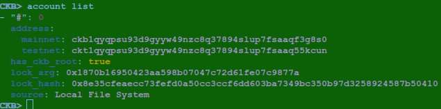
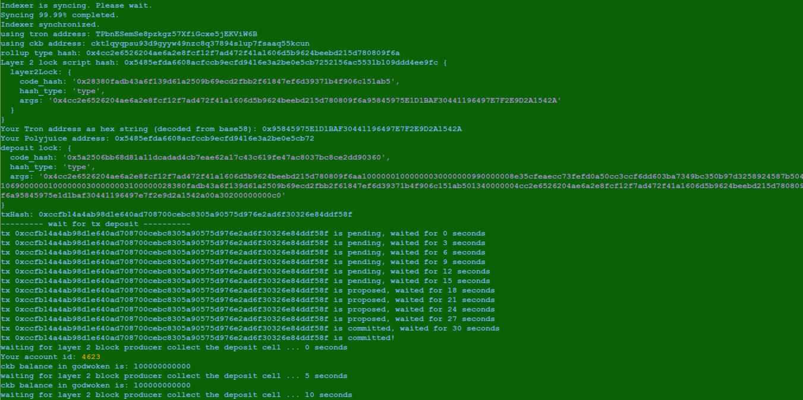
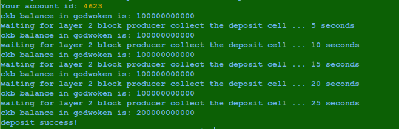
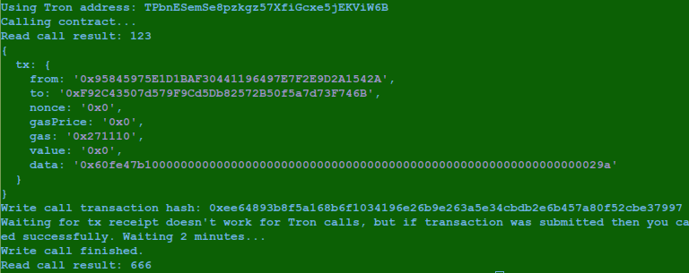

# Task 11 Use Tron Wallet to Make Call

1) Screenshot of account list



2) Layer 1 Address Link

https://explorer.nervos.org/aggron/address/ckt1qyqpsu93d9gyyw49nzc8q37894slup7fsaaq55kcun

3) Screenshot of CkByte deposit to tron account on layer 2




4) Screenshot of call on layer 2



5) Transaction hash of the call
```
0xee64893b8f5a168b6f1034196e26b9e263a5e34cbdb2e6b457a80f52cbe37997
```

6) Contract address that was called
```
0xF92C43507d579F9Cd5Db82572B50f5a7d73F746B
```

7) ABI for contract that was called
```
[
    {
      "inputs": [],
      "stateMutability": "payable",
      "type": "constructor"
    },
    {
      "inputs": [
        {
          "internalType": "uint256",
          "name": "x",
          "type": "uint256"
        }
      ],
      "name": "set",
      "outputs": [],
      "stateMutability": "payable",
      "type": "function"
    },
    {
      "inputs": [],
      "name": "get",
      "outputs": [
        {
          "internalType": "uint256",
          "name": "",
          "type": "uint256"
        }
      ],
      "stateMutability": "view",
      "type": "function"
    }
]
```

8) The Tron Address
```
TPbnESemSe8pzkgz57XfiGcxe5jEKViW6B
```
