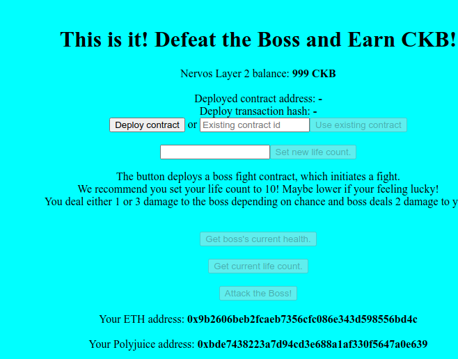
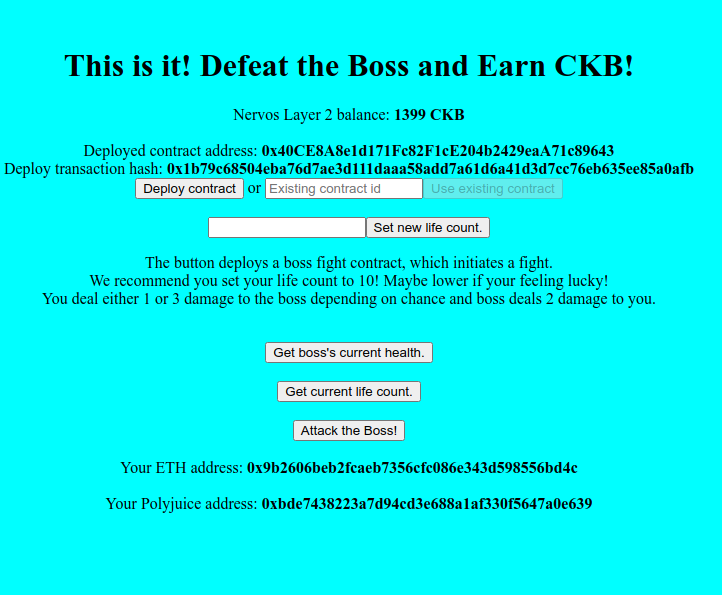

# Task 7 Port a DApp

1) Screenshots






2) Link to Repo

https://github.com/RuggedCardigan/Bounty-Nervos-Dapp


3) Transaction hash of smart contract:
```
0x1b79c68504eba76d7ae3d111daaa58add7a61d6a41d3d7cc76eb635ee85a0afb
```
Contract address:

0x40CE8A8e1d171Fc82F1cE204b2429eaA71c89643

ABI of Smart Contract
```
[
        {
            "inputs": [],
            "stateMutability": "payable",
            "type": "constructor"
        },
        {
            "inputs": [
                {
                    "internalType": "int256",
                    "name": "hearts",
                    "type": "int256"
                }
            ],
            "name": "setLives",
            "outputs": [],
            "stateMutability": "payable",
            "type": "function"
        },
        {
            "inputs": [],
            "name": "getBossHealth",
            "outputs": [
                {
                    "internalType": "int256",
                    "name": "",
                    "type": "int256"
                }
            ],
            "stateMutability": "view",
            "type": "function"
        },
        {
            "inputs": [],
            "name": "getMyLives",
            "outputs": [
                {
                    "internalType": "int256",
                    "name": "",
                    "type": "int256"
                }
            ],
            "stateMutability": "view",
            "type": "function"
        },
        {
            "inputs": [],
            "name": "Attack",
            "outputs": [],
            "stateMutability": "payable",
            "type": "function"
        }
    ]
```
