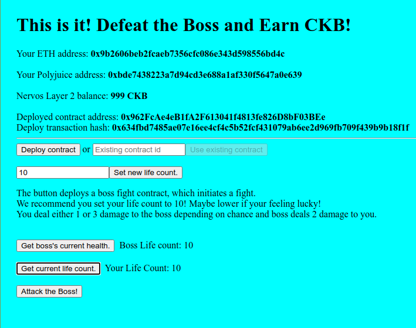
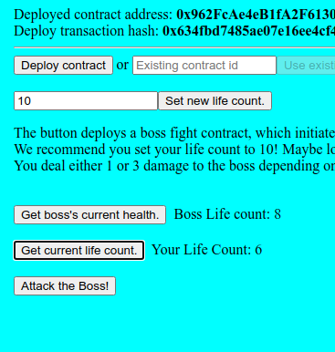

# Task 7 Port a DApp

1) Screenshots




2) Link to Repo

https://github.com/RuggedCardigan/Bounty-Nervos-Dapp

3) ABI of Smart Contract
```
[
        {
            "inputs": [],
            "stateMutability": "payable",
            "type": "constructor"
        },
        {
            "inputs": [
                {
                    "internalType": "int256",
                    "name": "hearts",
                    "type": "int256"
                }
            ],
            "name": "setLives",
            "outputs": [],
            "stateMutability": "payable",
            "type": "function"
        },
        {
            "inputs": [],
            "name": "getBossHealth",
            "outputs": [
                {
                    "internalType": "int256",
                    "name": "",
                    "type": "int256"
                }
            ],
            "stateMutability": "view",
            "type": "function"
        },
        {
            "inputs": [],
            "name": "getMyLives",
            "outputs": [
                {
                    "internalType": "int256",
                    "name": "",
                    "type": "int256"
                }
            ],
            "stateMutability": "view",
            "type": "function"
        },
        {
            "inputs": [],
            "name": "Attack",
            "outputs": [],
            "stateMutability": "payable",
            "type": "function"
        }
    ]
```
